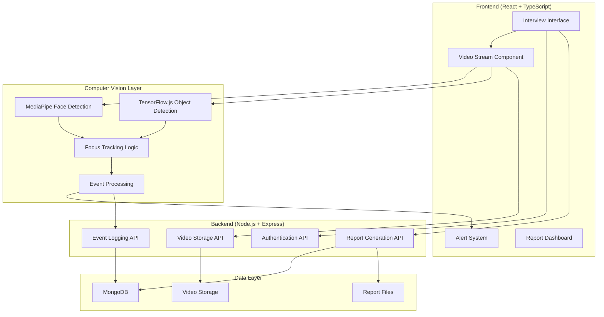

# Design Document

## Overview

The Video Proctoring System is a real-time monitoring application built with the MERN stack that uses computer vision and machine learning to detect focus levels and unauthorized items during video interviews. The system consists of a React frontend with TypeScript for the interview interface, a Node.js backend with Express for API services, MongoDB for data persistence, and integrated CV libraries for real-time detection capabilities.

## Architecture

### High-Level Architecture



### Technology Stack

- **Frontend**: React 18 + TypeScript + Vite
- **UI Framework**: Shadcn UI + Tailwind CSS
- **Computer Vision**: MediaPipe + TensorFlow.js
- **Backend**: Node.js + Express + TypeScript
- **Database**: MongoDB with Mongoose ODM
- **Video Processing**: WebRTC for streaming, FFmpeg for recording
- **Deployment**: Vercel (Frontend) + Railway/Render (Backend)

## Components and Interfaces

### Frontend Components

#### 1. Interview Interface Component
```typescript
interface InterviewInterfaceProps {
  candidateId: string;
  sessionId: string;
  onSessionEnd: () => void;
}

interface InterviewState {
  isRecording: boolean;
  alerts: Alert[];
  sessionDuration: number;
  detectionEvents: DetectionEvent[];
}
```

#### 2. Video Stream Component
```typescript
interface VideoStreamProps {
  onFrameCapture: (imageData: ImageData) => void;
  onRecordingStart: () => void;
  onRecordingStop: () => void;
}

interface VideoStreamState {
  stream: MediaStream | null;
  isStreaming: boolean;
  recordedChunks: Blob[];
}
```

#### 3. Detection Alert Component
```typescript
interface AlertProps {
  type: 'focus-loss' | 'absence' | 'multiple-faces' | 'unauthorized-item';
  message: string;
  timestamp: Date;
  severity: 'low' | 'medium' | 'high';
}
```

### Computer Vision Modules

#### 1. Focus Detection Service
```typescript
interface FocusDetectionService {
  detectFace(imageData: ImageData): FaceDetectionResult;
  trackGazeDirection(landmarks: FaceLandmarks): GazeDirection;
  checkFocusStatus(gazeDirection: GazeDirection): FocusStatus;
  startFocusTimer(eventType: 'looking-away' | 'absent'): void;
}

interface FaceDetectionResult {
  faces: Face[];
  landmarks: FaceLandmarks[];
  confidence: number;
}

interface GazeDirection {
  x: number;
  y: number;
  isLookingAtScreen: boolean;
}
```

#### 2. Object Detection Service
```typescript
interface ObjectDetectionService {
  detectObjects(imageData: ImageData): ObjectDetectionResult[];
  classifyUnauthorizedItems(objects: DetectedObject[]): UnauthorizedItem[];
  trackObjectPresence(item: UnauthorizedItem): void;
}

interface DetectedObject {
  class: string;
  confidence: number;
  boundingBox: BoundingBox;
}

interface UnauthorizedItem {
  type: 'phone' | 'book' | 'notes' | 'electronic-device';
  confidence: number;
  position: BoundingBox;
  firstDetected: Date;
}
```

### Backend API Interfaces

#### 1. Event Logging API
```typescript
interface EventLogAPI {
  POST /api/events: (event: DetectionEvent) => Promise<EventResponse>;
  GET /api/events/:sessionId: () => Promise<DetectionEvent[]>;
  GET /api/events/summary/:sessionId: () => Promise<EventSummary>;
}

interface DetectionEvent {
  sessionId: string;
  candidateId: string;
  eventType: EventType;
  timestamp: Date;
  duration?: number;
  confidence: number;
  metadata: Record<string, any>;
}
```

#### 2. Report Generation API
```typescript
interface ReportAPI {
  POST /api/reports/generate: (sessionId: string) => Promise<ReportResponse>;
  GET /api/reports/:reportId: () => Promise<ProctoringReport>;
  GET /api/reports/:reportId/export: (format: 'pdf' | 'csv') => Promise<Buffer>;
}

interface ProctoringReport {
  candidateId: string;
  candidateName: string;
  sessionId: string;
  interviewDuration: number;
  focusLossCount: number;
  suspiciousEvents: SuspiciousEvent[];
  integrityScore: number;
  generatedAt: Date;
}
```

## Data Models

### MongoDB Schemas

#### 1. Detection Event Schema
```typescript
const DetectionEventSchema = new Schema({
  sessionId: { type: String, required: true, index: true },
  candidateId: { type: String, required: true, index: true },
  eventType: {
    type: String,
    enum: ['focus-loss', 'absence', 'multiple-faces', 'unauthorized-item'],
    required: true
  },
  timestamp: { type: Date, required: true, index: true },
  duration: { type: Number }, // in seconds
  confidence: { type: Number, min: 0, max: 1 },
  metadata: {
    gazeDirection: { x: Number, y: Number },
    objectType: String,
    boundingBox: {
      x: Number, y: Number, width: Number, height: Number
    },
    faceCount: Number
  },
  createdAt: { type: Date, default: Date.now }
});
```

#### 2. Interview Session Schema
```typescript
const InterviewSessionSchema = new Schema({
  sessionId: { type: String, required: true, unique: true },
  candidateId: { type: String, required: true },
  candidateName: { type: String, required: true },
  startTime: { type: Date, required: true },
  endTime: { type: Date },
  duration: { type: Number }, // in seconds
  videoUrl: { type: String },
  status: {
    type: String,
    enum: ['active', 'completed', 'terminated'],
    default: 'active'
  },
  createdAt: { type: Date, default: Date.now }
});
```

#### 3. Proctoring Report Schema
```typescript
const ProctoringReportSchema = new Schema({
  reportId: { type: String, required: true, unique: true },
  sessionId: { type: String, required: true, ref: 'InterviewSession' },
  candidateId: { type: String, required: true },
  candidateName: { type: String, required: true },
  interviewDuration: { type: Number, required: true },
  focusLossCount: { type: Number, default: 0 },
  absenceCount: { type: Number, default: 0 },
  multipleFacesCount: { type: Number, default: 0 },
  unauthorizedItemsCount: { type: Number, default: 0 },
  integrityScore: { type: Number, min: 0, max: 100 },
  suspiciousEvents: [{
    eventType: String,
    timestamp: Date,
    duration: Number,
    description: String
  }],
  generatedAt: { type: Date, default: Date.now }
});
```

## Error Handling

### Frontend Error Handling
- **Camera Access Errors**: Graceful fallback with user instructions
- **Network Connectivity**: Offline detection with event queuing
- **CV Library Failures**: Error boundaries with fallback detection methods
- **Real-time Processing**: Frame dropping strategies for performance

### Backend Error Handling
- **Database Connection**: Retry logic with exponential backoff
- **API Rate Limiting**: Request throttling and queue management
- **File Upload Errors**: Chunked upload with resume capability
- **Report Generation**: Async processing with status tracking

### Detection Algorithm Error Handling
- **False Positives**: Confidence thresholds and temporal filtering
- **Performance Issues**: Adaptive frame rate and resolution scaling
- **Model Loading**: Progressive enhancement with fallback models

## Testing Strategy

### Unit Testing
- **Frontend Components**: React Testing Library + Jest
- **CV Services**: Mock image data and assertion testing
- **Backend APIs**: Supertest + Jest for endpoint testing
- **Database Models**: MongoDB Memory Server for isolated testing

### Integration Testing
- **End-to-End Flows**: Playwright for complete user journeys
- **Real-time Detection**: Automated video feed testing
- **Report Generation**: Full pipeline testing with sample data

### Performance Testing
- **Real-time Processing**: Frame rate and latency benchmarks
- **Concurrent Sessions**: Load testing with multiple video streams
- **Database Performance**: Query optimization and indexing validation

### Computer Vision Testing
- **Detection Accuracy**: Curated test datasets for focus and object detection
- **Edge Cases**: Low light, multiple angles, partial occlusion scenarios
- **Calibration**: Cross-device and cross-browser compatibility testing

## Security Considerations

### Data Privacy
- **Video Encryption**: End-to-end encryption for video streams
- **Data Retention**: Configurable retention policies
- **Access Control**: Role-based permissions for report access

### System Security
- **API Authentication**: JWT tokens with refresh mechanism
- **Input Validation**: Comprehensive sanitization for all inputs
- **Rate Limiting**: Protection against abuse and DoS attacks

## Performance Optimization

### Real-time Processing
- **Frame Sampling**: Intelligent frame selection for CV processing
- **Web Workers**: Offload CV computations from main thread
- **Model Optimization**: Quantized models for faster inference

### Scalability
- **Horizontal Scaling**: Stateless backend design
- **Caching Strategy**: Redis for session data and frequent queries
- **CDN Integration**: Video storage and delivery optimization